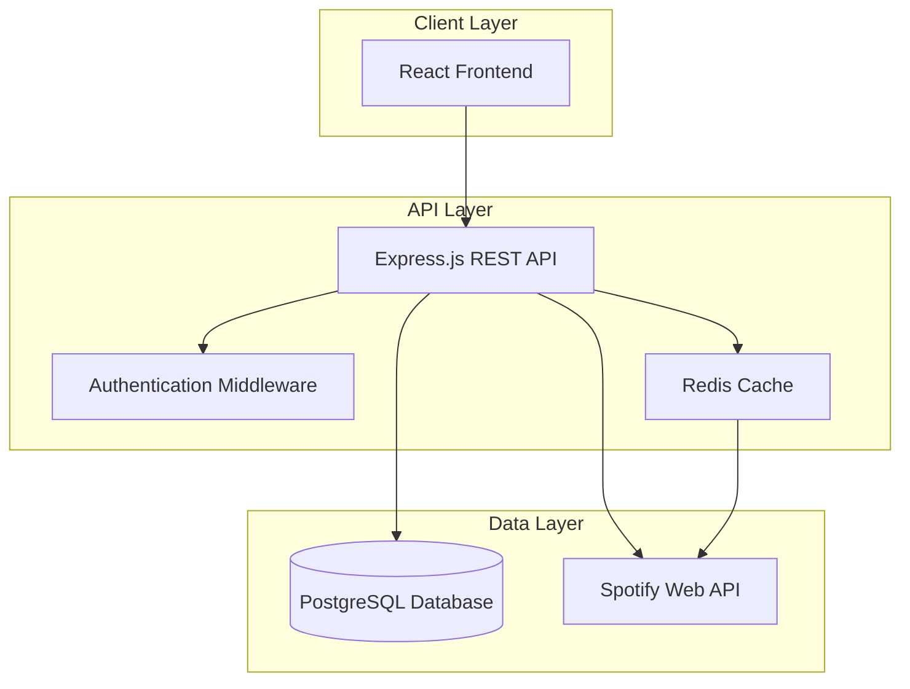

# Design Document: JukeBoxd

## Overview

JukeBoxd is a social music discovery web application built using a modern three-tier architecture with RESTful API design. The system integrates with Spotify's Web API to provide comprehensive album data while maintaining a clean separation between data access, business logic, and presentation layers. The application follows MVC architectural patterns with a React frontend, Node.js/Express backend, and PostgreSQL database.

Key architectural decisions:
- **RESTful API**: Stateless, resource-oriented endpoints for clean client-server communication
- **OAuth 2.0 Integration**: Secure authentication flow with Spotify API using Authorization Code Flow
- **Activity Feed Architecture**: Fanout-on-read pattern for scalable social feed generation
- **Caching Strategy**: Redis-based caching for Spotify API responses and user sessions

## Architecture

### System Architecture



### Technology Stack

**Frontend:**
- React 18 with TypeScript for type safety
- React Router for client-side routing
- Axios for HTTP client communication
- Material-UI for consistent component design

**Backend:**
- Node.js with Express.js framework
- TypeScript for enhanced developer experience
- JWT for session management
- bcrypt for password hashing

**Database:**
- PostgreSQL for relational data storage
- Redis for caching and session storage

**External Services:**
- Spotify Web API for album data and search

## Components and Interfaces

### Core Components

#### 1. Authentication Service
**Responsibilities:**
- User registration and login
- JWT token generation and validation
- Password hashing and verification
- Session management

**Key Methods:**
```typescript
interface AuthService {
  register(username: string, email: string, password: string): Promise<User>
  login(username: string, password: string): Promise<AuthToken>
  validateToken(token: string): Promise<User>
  logout(token: string): Promise<void>
}
```

#### 2. Spotify Integration Service
**Responsibilities:**
- Spotify API authentication using Client Credentials Flow
- Album search and metadata retrieval
- API rate limiting and error handling
- Response caching for performance

**Key Methods:**
```typescript
interface SpotifyService {
  searchAlbums(query: string, limit: number): Promise<Album[]>
  getAlbum(spotifyId: string): Promise<Album>
  refreshAccessToken(): Promise<string>
}
```

#### 3. Rating Service
**Responsibilities:**
- Album rating creation and updates
- Rating validation (1-5 stars)
- Average rating calculations
- User rating history

**Key Methods:**
```typescript
interface RatingService {
  rateAlbum(userId: string, albumId: string, rating: number): Promise<Rating>
  getUserRating(userId: string, albumId: string): Promise<Rating | null>
  getAlbumAverageRating(albumId: string): Promise<number>
  getUserRatings(userId: string): Promise<Rating[]>
}
```

#### 4. Review Service
**Responsibilities:**
- Review creation, editing, and deletion
- Review validation and sanitization
- Review retrieval by album and user
- Review timestamp management

**Key Methods:**
```typescript
interface ReviewService {
  createReview(userId: string, albumId: string, content: string): Promise<Review>
  updateReview(reviewId: string, content: string): Promise<Review>
  getAlbumReviews(albumId: string): Promise<Review[]>
  getUserReviews(userId: string): Promise<Review[]>
}
```

#### 5. Social Service
**Responsibilities:**
- User following/unfollowing relationships
- Follower and following counts
- User discovery and profiles
- Follow relationship validation

**Key Methods:**
```typescript
interface SocialService {
  followUser(followerId: string, followeeId: string): Promise<void>
  unfollowUser(followerId: string, followeeId: string): Promise<void>
  getFollowers(userId: string): Promise<User[]>
  getFollowing(userId: string): Promise<User[]>
  isFollowing(followerId: string, followeeId: string): Promise<boolean>
}
```

#### 6. Activity Feed Service
**Responsibilities:**
- Activity feed generation using fanout-on-read pattern
- Activity creation for ratings and reviews
- Feed pagination and ordering
- Real-time activity updates

**Key Methods:**
```typescript
interface ActivityFeedService {
  getFeed(userId: string, limit: number, offset: number): Promise<Activity[]>
  createActivity(userId: string, type: ActivityType, data: any): Promise<Activity>
  getRecentActivities(userIds: string[], limit: number): Promise<Activity[]>
}
```

### REST API Endpoints

#### Authentication Endpoints
- `POST /api/auth/register` - User registration
- `POST /api/auth/login` - User login
- `POST /api/auth/logout` - User logout
- `GET /api/auth/me` - Get current user profile

#### Album Endpoints
- `GET /api/albums/search?q={query}` - Search albums via Spotify
- `GET /api/albums/{spotifyId}` - Get album details
- `GET /api/albums/{spotifyId}/ratings` - Get album ratings
- `GET /api/albums/{spotifyId}/reviews` - Get album reviews

#### Rating Endpoints
- `POST /api/ratings` - Create or update album rating
- `GET /api/ratings/user/{userId}` - Get user's ratings
- `DELETE /api/ratings/{ratingId}` - Delete rating

#### Review Endpoints
- `POST /api/reviews` - Create album review
- `PUT /api/reviews/{reviewId}` - Update review
- `DELETE /api/reviews/{reviewId}` - Delete review
- `GET /api/reviews/user/{userId}` - Get user's reviews

#### Social Endpoints
- `POST /api/social/follow` - Follow a user
- `DELETE /api/social/follow/{userId}` - Unfollow a user
- `GET /api/social/followers/{userId}` - Get user's followers
- `GET /api/social/following/{userId}` - Get users being followed

#### Feed Endpoints
- `GET /api/feed` - Get personalized activity feed
- `GET /api/feed/user/{userId}` - Get user's public activity

## Data Models

### User Model
```typescript
interface User {
  id: string
  username: string
  email: string
  passwordHash: string
  createdAt: Date
  updatedAt: Date
}
```

### Album Model
```typescript
interface Album {
  id: string
  spotifyId: string
  name: string
  artist: string
  releaseDate: Date
  imageUrl: string
  spotifyUrl: string
  createdAt: Date
  updatedAt: Date
}
```

### Rating Model
```typescript
interface Rating {
  id: string
  userId: string
  albumId: string
  rating: number // 1-5
  createdAt: Date
  updatedAt: Date
}
```

### Review Model
```typescript
interface Review {
  id: string
  userId: string
  albumId: string
  content: string
  createdAt: Date
  updatedAt: Date
}
```

### Follow Model
```typescript
interface Follow {
  id: string
  followerId: string
  followeeId: string
  createdAt: Date
}
```

### Activity Model
```typescript
interface Activity {
  id: string
  userId: string
  type: 'rating' | 'review'
  albumId: string
  data: any // Rating value or review content
  createdAt: Date
}
```

### Database Schema

```sql
-- Users table
CREATE TABLE users (
  id UUID PRIMARY KEY DEFAULT gen_random_uuid(),
  username VARCHAR(50) UNIQUE NOT NULL,
  email VARCHAR(255) UNIQUE NOT NULL,
  password_hash VARCHAR(255) NOT NULL,
  created_at TIMESTAMP DEFAULT CURRENT_TIMESTAMP,
  updated_at TIMESTAMP DEFAULT CURRENT_TIMESTAMP
);

-- Albums table
CREATE TABLE albums (
  id UUID PRIMARY KEY DEFAULT gen_random_uuid(),
  spotify_id VARCHAR(255) UNIQUE NOT NULL,
  name VARCHAR(255) NOT NULL,
  artist VARCHAR(255) NOT NULL,
  release_date DATE,
  image_url TEXT,
  spotify_url TEXT,
  created_at TIMESTAMP DEFAULT CURRENT_TIMESTAMP,
  updated_at TIMESTAMP DEFAULT CURRENT_TIMESTAMP
);

-- Ratings table
CREATE TABLE ratings (
  id UUID PRIMARY KEY DEFAULT gen_random_uuid(),
  user_id UUID REFERENCES users(id) ON DELETE CASCADE,
  album_id UUID REFERENCES albums(id) ON DELETE CASCADE,
  rating INTEGER CHECK (rating >= 1 AND rating <= 5),
  created_at TIMESTAMP DEFAULT CURRENT_TIMESTAMP,
  updated_at TIMESTAMP DEFAULT CURRENT_TIMESTAMP,
  UNIQUE(user_id, album_id)
);

-- Reviews table
CREATE TABLE reviews (
  id UUID PRIMARY KEY DEFAULT gen_random_uuid(),
  user_id UUID REFERENCES users(id) ON DELETE CASCADE,
  album_id UUID REFERENCES albums(id) ON DELETE CASCADE,
  content TEXT NOT NULL,
  created_at TIMESTAMP DEFAULT CURRENT_TIMESTAMP,
  updated_at TIMESTAMP DEFAULT CURRENT_TIMESTAMP,
  UNIQUE(user_id, album_id)
);

-- Follows table
CREATE TABLE follows (
  id UUID PRIMARY KEY DEFAULT gen_random_uuid(),
  follower_id UUID REFERENCES users(id) ON DELETE CASCADE,
  followee_id UUID REFERENCES users(id) ON DELETE CASCADE,
  created_at TIMESTAMP DEFAULT CURRENT_TIMESTAMP,
  UNIQUE(follower_id, followee_id),
  CHECK(follower_id != followee_id)
);

-- Activities table
CREATE TABLE activities (
  id UUID PRIMARY KEY DEFAULT gen_random_uuid(),
  user_id UUID REFERENCES users(id) ON DELETE CASCADE,
  type VARCHAR(20) NOT NULL,
  album_id UUID REFERENCES albums(id) ON DELETE CASCADE,
  data JSONB,
  created_at TIMESTAMP DEFAULT CURRENT_TIMESTAMP
);

-- Indexes for performance
CREATE INDEX idx_ratings_user_id ON ratings(user_id);
CREATE INDEX idx_ratings_album_id ON ratings(album_id);
CREATE INDEX idx_reviews_user_id ON reviews(user_id);
CREATE INDEX idx_reviews_album_id ON reviews(album_id);
CREATE INDEX idx_follows_follower_id ON follows(follower_id);
CREATE INDEX idx_follows_followee_id ON follows(followee_id);
CREATE INDEX idx_activities_user_id ON activities(user_id);
CREATE INDEX idx_activities_created_at ON activities(created_at DESC);
```

## Correctness Properties

*A property is a characteristic or behavior that should hold true across all valid executions of a system—essentially, a formal statement about what the system should do. Properties serve as the bridge between human-readable specifications and machine-verifiable correctness guarantees.*

### Property 1: Album Search Completeness
*For any* search query, the system should retrieve matching albums from Spotify API and display them with complete information (title, artist, release year, cover art)
**Validates: Requirements 1.1, 1.2**

### Property 2: Rating Storage and Retrieval
*For any* valid user, album, and rating (1-5), storing a rating should make it retrievable and correctly associated with both user and album
**Validates: Requirements 2.2, 2.3**

### Property 3: Rating Average Calculation
*For any* album with multiple ratings, the displayed average should equal the mathematical mean of all ratings for that album
**Validates: Requirements 2.4**

### Property 4: Review Storage and Chronological Ordering
*For any* valid review content, storing a review should make it retrievable with correct timestamp, and multiple reviews should display in chronological order
**Validates: Requirements 3.2, 3.3, 3.4**

### Property 5: Whitespace Review Rejection
*For any* string composed entirely of whitespace characters, attempting to submit it as a review should be rejected and leave the system state unchanged
**Validates: Requirements 3.5**

### Property 6: Follow Relationship Management
*For any* two distinct users, creating a follow relationship should update follower/following counts and be reflected in profile displays and button states
**Validates: Requirements 4.2, 4.3, 4.4**

### Property 7: Activity Feed Generation
*For any* user with followed users, their feed should contain recent activities (ratings and reviews) from those followed users, ordered chronologically with most recent first
**Validates: Requirements 5.1, 5.2, 5.3, 5.4**

### Property 8: User Authentication Validation
*For any* login attempt, the system should authenticate valid credentials and reject invalid ones with appropriate responses
**Validates: Requirements 6.2, 6.3**

### Property 9: User Registration Uniqueness
*For any* registration attempt, the system should create unique user accounts and prevent duplicate usernames or emails
**Validates: Requirements 6.1**

### Property 10: Profile Information Display
*For any* user profile view, the display should include all required information (username, join date, recent activity) with appropriate editing capabilities for the profile owner
**Validates: Requirements 6.4, 6.5**

### Property 11: Data Persistence Consistency
*For any* user-created content (ratings, reviews), the data should be immediately persisted and remain available across system operations
**Validates: Requirements 7.1**

### Property 12: Password Security
*For any* user password, the stored version should be cryptographically hashed and never stored in plaintext
**Validates: Requirements 7.3**

### Property 13: Account Deletion Data Handling
*For any* user account deletion, personal data should be removed while maintaining system integrity and anonymized contributions
**Validates: Requirements 7.5**

### Property 14: Spotify API Integration
*For any* Spotify API request, the system should include proper authentication and correctly parse valid responses
**Validates: Requirements 8.1, 8.2**

### Property 15: API Caching Behavior
*For any* album data retrieved from Spotify, subsequent requests for the same data should use cached results when available
**Validates: Requirements 8.4**

### Property 16: API Error Handling
*For any* Spotify API error response, the system should handle it gracefully and provide meaningful feedback to users
**Validates: Requirements 8.3, 8.5**

## Error Handling

### Client-Side Error Handling
- **Network Errors**: Display user-friendly messages for connection issues with retry options
- **Validation Errors**: Provide immediate feedback for invalid form inputs
- **Authentication Errors**: Redirect to login page with appropriate messaging
- **Rate Limiting**: Show temporary unavailability messages with suggested wait times

### Server-Side Error Handling
- **Database Errors**: Log errors and return generic error messages to prevent information leakage
- **Spotify API Errors**: Implement exponential backoff for rate limits and circuit breaker pattern for service unavailability
- **Authentication Failures**: Return standardized error responses without revealing user existence
- **Input Validation**: Sanitize and validate all user inputs to prevent injection attacks

### Error Response Format
```typescript
interface ErrorResponse {
  error: {
    code: string
    message: string
    details?: any
  }
  timestamp: string
  path: string
}
```

### Logging Strategy
- **Error Logging**: All errors logged with context, user ID (if available), and stack traces
- **Audit Logging**: User actions (login, rating, review) logged for security and analytics
- **Performance Logging**: API response times and database query performance
- **Security Logging**: Failed authentication attempts and suspicious activities

## Testing Strategy

### Dual Testing Approach

The testing strategy employs both unit testing and property-based testing as complementary approaches:

**Unit Tests:**
- Focus on specific examples, edge cases, and error conditions
- Test integration points between components
- Verify concrete behaviors with known inputs and expected outputs
- Cover authentication flows, API error scenarios, and UI component rendering

**Property-Based Tests:**
- Verify universal properties that hold across all valid inputs
- Use randomized input generation to discover edge cases
- Validate correctness properties through comprehensive input coverage
- Each property test runs minimum 100 iterations for thorough validation

### Property-Based Testing Configuration

**Testing Library:** fast-check (JavaScript/TypeScript property-based testing library)

**Test Configuration:**
- Minimum 100 iterations per property test
- Custom generators for domain objects (Users, Albums, Ratings, Reviews)
- Shrinking enabled to find minimal failing examples
- Timeout configuration for long-running tests

**Property Test Tagging:**
Each property-based test must include a comment referencing its design document property:
```typescript
// Feature: jukeboxd, Property 1: Album Search Completeness
```

### Test Categories

#### 1. Authentication Tests
- **Unit Tests**: Login/logout flows, token validation, password hashing
- **Property Tests**: Authentication validation across all credential combinations

#### 2. Spotify Integration Tests
- **Unit Tests**: API error handling, rate limiting, specific search scenarios
- **Property Tests**: API request formatting, response parsing, caching behavior

#### 3. Social Features Tests
- **Unit Tests**: Follow/unfollow actions, profile displays, specific feed scenarios
- **Property Tests**: Relationship management, feed generation, activity ordering

#### 4. Content Management Tests
- **Unit Tests**: Rating/review CRUD operations, validation edge cases
- **Property Tests**: Data persistence, content association, average calculations

#### 5. UI Component Tests
- **Unit Tests**: Component rendering, user interactions, form validation
- **Property Tests**: Display completeness, state management consistency

### Test Data Management

**Test Database:**
- Separate test database with identical schema
- Database reset between test suites
- Transaction rollback for individual tests

**Mock Services:**
- Spotify API mocked for consistent testing
- Redis cache mocked for unit tests
- Email service mocked for registration tests

**Test Data Generators:**
- Faker.js for realistic test data generation
- Custom generators for domain-specific objects
- Property-based test generators for comprehensive coverage

### Continuous Integration

**Test Execution:**
- All tests run on every pull request
- Property-based tests run with extended iteration counts in CI
- Performance benchmarks for critical paths
- Security scanning for dependencies and code

**Coverage Requirements:**
- Minimum 80% code coverage for unit tests
- All correctness properties must have corresponding property-based tests
- Integration tests for all API endpoints
- End-to-end tests for critical user journeys